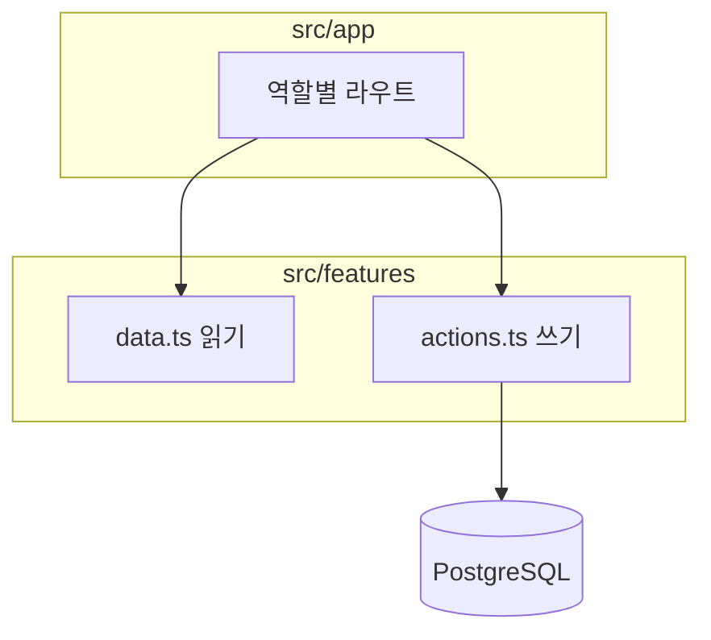

<div align="center">

# 학원 관리 플랫폼

원장부터 학부모까지, 출결·성적·상담·AI 리포트를 한곳에서.


[기능](#주요-기능) · [실행](#실행-방법) · [구조](#프로젝트-구조) · [Google 로그인](#google-로그인-설정) · [데이터베이스](#데이터베이스) · [원장 설정](#최초-원장-설정)

</div>

비밀번호 없이 Google로만 로그인하며, 역할은 가입자가 고르지 않고 원장이 부여합니다.

## 주요 기능

| 역할 | 홈 | 하는 일 |
| --- | --- | --- |
| 원장 | `/director` | 대시보드, 이탈 위험, AI 리포트 승인, 반·학생·권한, 가입자 역할 부여 |
| 교사 | `/teacher` | 출석, 성적·오답, AI 리포트 초안, 상담, 쪽지 |
| 직원 | `/employee` | 학생, 상담, 쪽지, 청구 |
| 학부모 | `/parent` | 자녀 출결·성적·리포트·쪽지함·시간표 |
| 학생 | `/student` | 시간표, 성적, 체험 소식, 쪽지 |
| 게스트 | `/` | 학원 소개, 상담 문의 |

교사·직원 세부 권한은 `PermissionGrant`로 켜고 끕니다.

> [!NOTE]
> 학부모 결제 PG 연동은 아직 준비 중입니다.

## 실행 방법

필요: Node.js, PostgreSQL, Google OAuth 클라이언트.

1. `.env.example` → `.env.local`
2. `npm install` → `npx prisma migrate dev`
3. `npm run dev` → http://localhost:3000

원장 계정은 서버가 뜬 뒤 `npm run bootstrap:director -- you@gmail.com` 한 번입니다.

```bash
npm run validate   # lint, typecheck, prisma validate, production build
```

## 프로젝트 구조

`app`은 라우팅, `features/{domain}`은 데이터와 변경입니다. Server Action은 진입점마다 인증·권한을 다시 확인합니다.

```text
prisma/                 스키마·마이그레이션
scripts/                원장 부트스트랩·시드
src/app/(auth)/         로그인·가입·역할 분기
src/app/(director)/     원장
src/app/(teacher)/      교사
src/app/(employee)/     직원
src/app/(parent)/       학부모
src/app/(student)/      학생
src/app/(guest)/        게스트
src/features/           도메인 조회·Server Action·화면
src/lib/                인증·DB·권한
src/proxy.ts            역할별 URL 가드 (Next.js 16)
```



## Google 로그인 설정

1. [Google Cloud Console](https://console.cloud.google.com/)에서 OAuth 클라이언트를 **웹 애플리케이션**으로 만듭니다.
2. 승인된 리디렉션 URI에 `http://localhost:3000/api/auth/callback/google`을 넣습니다. 배포 시 `https://도메인/api/auth/callback/google`도 추가합니다.
3. `.env.example`을 `.env.local`로 복사합니다.
4. `AUTH_GOOGLE_ID`, `AUTH_GOOGLE_SECRET`을 넣고 `npx auth secret`으로 `AUTH_SECRET`을 만듭니다.

`.env.local`은 커밋하지 않습니다.

> [!NOTE]
> `/login`은 기존 회원만, `/signup`에서만 새 GUEST가 생깁니다. 온보딩을 마친 GUEST는 원장 화면의 역할 대기 목록에 나타납니다.

> [!WARNING]
> `ENABLE_DEV_LOGIN`은 로컬 전용입니다. 프로덕션 환경 변수에 넣지 마세요.

## 데이터베이스

PostgreSQL을 쓰며, 스키마의 기준은 `prisma/schema.prisma`입니다. 학원 테넌트 테이블은 없고 DB 하나 = 학원 하나입니다.

```bash
npx prisma migrate dev      # 로컬
npx prisma migrate deploy   # 배포
```

> [!TIP]
> 마이그레이션은 `DIRECT_URL`(직접 연결)을 씁니다. 풀러 `DATABASE_URL`로는 advisory lock이 실패할 수 있습니다.

주요 영역: 계정(`User`, `OAuthAccount`), 원생(`Student`, `ParentStudentLink`), 수업·출석(`Class`, `ClassSession`, `AttendanceRecord`), 학습(`GradeRecord`, `WrongNote`, `AiReport`), 운영(`Message`, `Invoice`, `ChurnCase`).

개발용 목 데이터는 `npm run db:seed:test`입니다. 운영 DB에서는 실행하지 마세요.

<details>
<summary>환경 변수</summary>

| 변수 | 용도 |
| --- | --- |
| `DATABASE_URL` | 앱 런타임 (풀러 가능) |
| `DIRECT_URL` | `prisma migrate` 직접 연결 |
| `AUTH_SECRET` | Auth.js 세션 서명 |
| `AUTH_GOOGLE_ID` / `AUTH_GOOGLE_SECRET` | Google OAuth |
| `BOOTSTRAP_SECRET` | 최초 원장 승격 |
| `NEXT_PUBLIC_SUPABASE_URL` / `SUPABASE_SERVICE_ROLE_KEY` | 공지 이미지 업로드 |
| `GEMINI_API_KEY` | AI 챗봇·리포트 |

</details>

## 최초 원장 설정

공개 가입으로는 DIRECTOR가 생기지 않습니다. Google 가입을 마친 **ACTIVE GUEST**를 한 번만 승격합니다. 개발 서버가 떠 있어야 합니다.

```bash
# .env.local에 BOOTSTRAP_SECRET을 넣은 뒤
npm run bootstrap:director -- director@example.com
```

이미 원장이 있으면 거부합니다. 이후 교사·직원·학부모·학생 역할은 `/director/users`에서 부여합니다.
